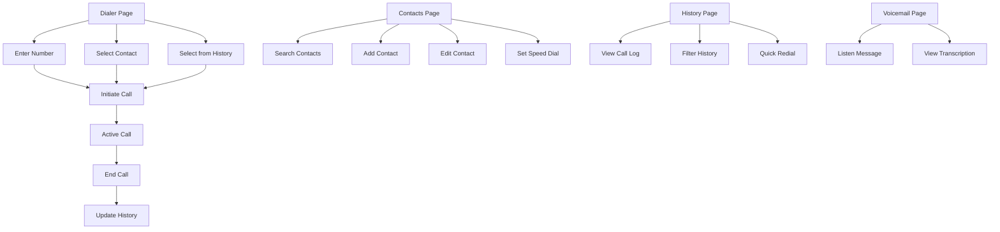

## 1. Product Overview
A comprehensive web-based telephone dialer application that enables users to make voice calls through SignalWire WebRTC, manage contacts, track call history, and access voicemail. The application provides a modern, accessible interface that works across all major platforms and devices.

Target users include businesses and individuals needing a professional calling solution with contact management and call tracking capabilities.

## 2. Core Features

### 2.1 User Roles
| Role | Registration Method | Core Permissions |
|------|---------------------|------------------|
| Standard User | Email/Phone registration | Make calls, manage contacts, view history |
| Premium User | Subscription upgrade | Advanced features, voicemail transcription, analytics |

### 2.2 Feature Module
The telephone dialer application consists of the following main pages:
1. **Dialer page**: Numeric keypad, call controls, number display, quick actions
2. **Contacts page**: Contact list, search/filter, add/edit contacts, speed dial
3. **History page**: Call log, timestamps, call details, quick redial
4. **Voicemail page**: Message list, playback controls, transcription (premium)

### 2.3 Page Details
| Page Name | Module Name | Feature description |
|-----------|-------------|---------------------|
| Dialer page | Numeric keypad | Display digits 0-9 with *, #, + buttons in grid layout. Provide tactile feedback on click. |
| Dialer page | Call controls | Initiate call button, end call button, mute/unmute, hold/resume functionality. |
| Dialer page | Number display | Show entered phone numbers with international formatting (+1 XXX-XXX-XXXX). |
| Dialer page | Quick actions | Speed dial buttons, recent contacts, voicemail access. |
| Contacts page | Contact list | Display all contacts alphabetically with avatar, name, phone number. |
| Contacts page | Search/filter | Real-time search by name or phone number with instant results. |
| Contacts page | Contact management | Add new contacts, edit existing, delete contacts, import/export functionality. |
| Contacts page | Speed dial | Assign frequently called contacts to speed dial slots (1-9). |
| History page | Call log | List all calls with direction (incoming/outgoing), duration, timestamp. |
| History page | Call details | View detailed call information, add notes, mark as important. |
| History page | Quick redial | One-click to call back any number from history. |
| Voicemail page | Message list | Display voicemail messages with caller info, duration, timestamp. |
| Voicemail page | Playback controls | Play, pause, scrub through messages with visual progress indicator. |
| Voicemail page | Transcription | Show text transcription of voicemail messages (premium feature). |

## 3. Core Process
**Standard User Flow:**
1. User lands on dialer page with numeric keypad visible
2. User enters phone number using keypad or selects from contacts/history
3. User clicks call button to initiate SignalWire WebRTC connection
4. System establishes call with real-time audio streaming
5. During call, user can mute, hold, or end call
6. Call details are automatically logged to history

**Contact Management Flow:**
1. User navigates to contacts page
2. User can search existing contacts or add new ones
3. User assigns speed dial numbers to frequent contacts
4. Contacts sync across devices when authenticated

**Call History Flow:**
1. All calls automatically logged with metadata
2. User can filter by date, contact, or call type
3. User can quickly redial or add notes to calls
4. History persists across sessions

## 4. User Interface Design

### 4.1 Design Style
- **Primary colors**: Professional blue (#2563EB) for primary actions, green (#10B981) for call initiation
- **Secondary colors**: Gray (#6B7280) for secondary actions, red (#EF4444) for end call
- **Button style**: Rounded corners (8px radius), subtle shadows, clear hover states
- **Font**: System fonts (Inter/SF Pro) for optimal readability, 16px base size
- **Layout**: Card-based design with clear visual hierarchy, consistent spacing (8px grid)
- **Icons**: Material Design icons for consistency and accessibility

### 4.2 Page Design Overview
| Page Name | Module Name | UI Elements |
|-----------|-------------|-------------|
| Dialer page | Numeric keypad | 4x4 grid layout with 64px buttons, high contrast text, haptic feedback on mobile. |
| Dialer page | Call controls | Large circular buttons (80px) with clear icons, positioned at bottom for thumb reach. |
| Dialer page | Number display | Clean input field with international formatting, 24px font size, auto-scrolling for long numbers. |
| Contacts page | Contact list | Avatar images, name in 18px font, phone number in 14px gray, swipe actions on mobile. |
| Contacts page | Search bar | Sticky header with search input, instant search results, voice search option. |
| History page | Call entries | Visual indicators for call direction, duration prominently displayed, grouped by date. |
| Voicemail page | Message cards | Play button, progress bar, caller info, duration badge, transcription preview. |

### 4.3 Responsiveness
- Desktop-first design with mobile adaptation
- Breakpoints: 320px (mobile), 768px (tablet), 1024px (desktop)
- Touch-optimized interactions for mobile devices
- Keyboard navigation support for accessibility
- Screen reader compatibility with proper ARIA labels

### 4.4 Accessibility Compliance
- WCAG 2.1 AA compliance for color contrast
- Keyboard navigation for all interactive elements
- Screen reader announcements for call status changes
- High contrast mode support
- Text scaling up to 200% without layout breaking