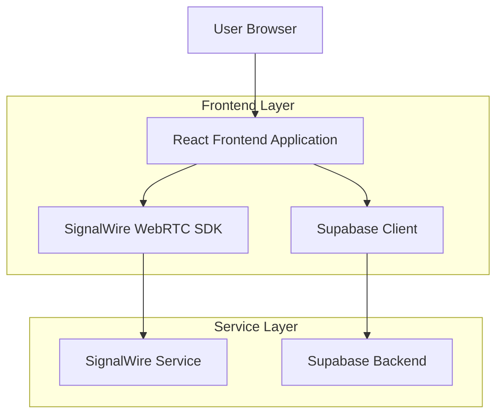
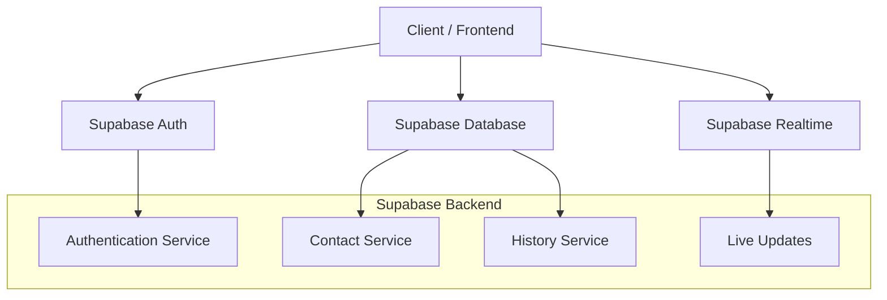
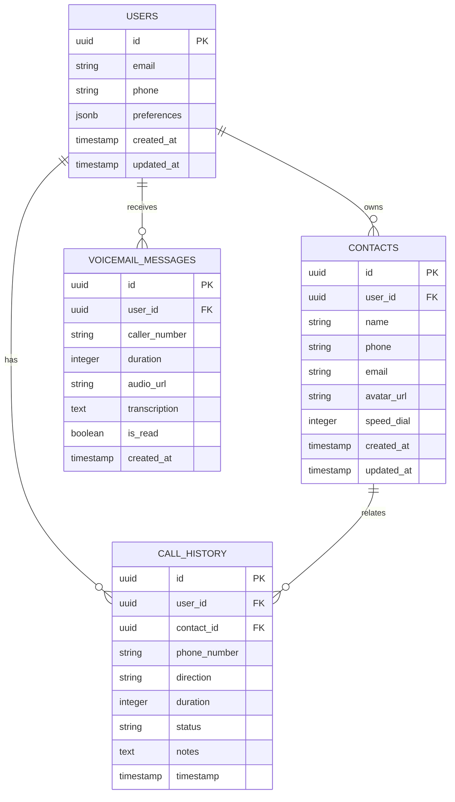

## 1. Architecture Design



## 2. Technology Description
- Frontend: React@18 + TypeScript + Tailwind CSS@3 + Vite
- Initialization Tool: vite-init
- WebRTC: SignalWire WebRTC SDK
- Backend: Supabase (PostgreSQL, Authentication, Real-time)
- State Management: React Context + Zustand
- Testing: Jest + React Testing Library + Cypress

## 3. Route Definitions
| Route | Purpose |
|-------|---------|
| / | Dialer page - Main calling interface |
| /contacts | Contacts management and speed dial |
| /history | Call history and logs |
| /voicemail | Voicemail messages and playback |
| /login | User authentication |
| /settings | Application preferences and account |

## 4. API Definitions

### 4.1 SignalWire WebRTC Integration
```typescript
interface CallSession {
  sessionId: string;
  remoteNumber: string;
  direction: 'inbound' | 'outbound';
  startTime: Date;
  endTime?: Date;
  status: 'connecting' | 'active' | 'ended' | 'failed';
}

interface CallOptions {
  audio: boolean;
  video: boolean;
  iceServers?: RTCIceServer[];
  codecPreferences?: string[];
}
```

### 4.2 Contact Management API
```typescript
interface Contact {
  id: string;
  name: string;
  phone: string;
  email?: string;
  avatar?: string;
  speedDial?: number;
  createdAt: Date;
  updatedAt: Date;
}

// Create contact
POST /api/contacts
Request: Omit<Contact, 'id' | 'createdAt' | 'updatedAt'>
Response: Contact

// List contacts with search
GET /api/contacts?search={query}&limit={number}
Response: Contact[]

// Update contact
PUT /api/contacts/{id}
Request: Partial<Contact>
Response: Contact
```

### 4.3 Call History API
```typescript
interface CallHistory {
  id: string;
  contactId?: string;
  phoneNumber: string;
  direction: 'inbound' | 'outbound';
  duration: number;
  timestamp: Date;
  status: 'completed' | 'missed' | 'failed';
  notes?: string;
}

// Get call history
GET /api/history?startDate={date}&endDate={date}&limit={number}
Response: CallHistory[]

// Add call note
PUT /api/history/{id}/note
Request: { notes: string }
Response: CallHistory
```

## 5. Server Architecture Diagram



## 6. Data Model

### 6.1 Database Schema


### 6.2 Data Definition Language

**Users Table**
```sql
CREATE TABLE users (
    id UUID PRIMARY KEY DEFAULT gen_random_uuid(),
    email VARCHAR(255) UNIQUE NOT NULL,
    phone VARCHAR(20),
    preferences JSONB DEFAULT '{}',
    created_at TIMESTAMP WITH TIME ZONE DEFAULT NOW(),
    updated_at TIMESTAMP WITH TIME ZONE DEFAULT NOW()
);

-- Indexes
CREATE INDEX idx_users_email ON users(email);
CREATE INDEX idx_users_phone ON users(phone);
```

**Contacts Table**
```sql
CREATE TABLE contacts (
    id UUID PRIMARY KEY DEFAULT gen_random_uuid(),
    user_id UUID NOT NULL REFERENCES users(id) ON DELETE CASCADE,
    name VARCHAR(255) NOT NULL,
    phone VARCHAR(20) NOT NULL,
    email VARCHAR(255),
    avatar_url TEXT,
    speed_dial INTEGER CHECK (speed_dial >= 1 AND speed_dial <= 9),
    created_at TIMESTAMP WITH TIME ZONE DEFAULT NOW(),
    updated_at TIMESTAMP WITH TIME ZONE DEFAULT NOW(),
    UNIQUE(user_id, speed_dial)
);

-- Indexes
CREATE INDEX idx_contacts_user_id ON contacts(user_id);
CREATE INDEX idx_contacts_name ON contacts(name);
CREATE INDEX idx_contacts_phone ON contacts(phone);
```

**Call History Table**
```sql
CREATE TABLE call_history (
    id UUID PRIMARY KEY DEFAULT gen_random_uuid(),
    user_id UUID NOT NULL REFERENCES users(id) ON DELETE CASCADE,
    contact_id UUID REFERENCES contacts(id) ON DELETE SET NULL,
    phone_number VARCHAR(20) NOT NULL,
    direction VARCHAR(10) NOT NULL CHECK (direction IN ('inbound', 'outbound')),
    duration INTEGER DEFAULT 0,
    status VARCHAR(20) NOT NULL CHECK (status IN ('completed', 'missed', 'failed')),
    notes TEXT,
    timestamp TIMESTAMP WITH TIME ZONE DEFAULT NOW()
);

-- Indexes
CREATE INDEX idx_call_history_user_id ON call_history(user_id);
CREATE INDEX idx_call_history_timestamp ON call_history(timestamp DESC);
CREATE INDEX idx_call_history_contact_id ON call_history(contact_id);
```

**Voicemail Messages Table**
```sql
CREATE TABLE voicemail_messages (
    id UUID PRIMARY KEY DEFAULT gen_random_uuid(),
    user_id UUID NOT NULL REFERENCES users(id) ON DELETE CASCADE,
    caller_number VARCHAR(20) NOT NULL,
    duration INTEGER NOT NULL,
    audio_url TEXT NOT NULL,
    transcription TEXT,
    is_read BOOLEAN DEFAULT FALSE,
    created_at TIMESTAMP WITH TIME ZONE DEFAULT NOW()
);

-- Indexes
CREATE INDEX idx_voicemail_user_id ON voicemail_messages(user_id);
CREATE INDEX idx_voicemail_created_at ON voicemail_messages(created_at DESC);
CREATE INDEX idx_voicemail_is_read ON voicemail_messages(is_read);
```

### 6.3 Row Level Security (RLS) Policies
```sql
-- Enable RLS
ALTER TABLE contacts ENABLE ROW LEVEL SECURITY;
ALTER TABLE call_history ENABLE ROW LEVEL SECURITY;
ALTER TABLE voicemail_messages ENABLE ROW LEVEL SECURITY;

-- Contacts policies
CREATE POLICY "Users can view own contacts" ON contacts
    FOR SELECT USING (auth.uid() = user_id);

CREATE POLICY "Users can insert own contacts" ON contacts
    FOR INSERT WITH CHECK (auth.uid() = user_id);

CREATE POLICY "Users can update own contacts" ON contacts
    FOR UPDATE USING (auth.uid() = user_id);

CREATE POLICY "Users can delete own contacts" ON contacts
    FOR DELETE USING (auth.uid() = user_id);

-- Similar policies for call_history and voicemail_messages
```

## 7. Security Implementation

### 7.1 SignalWire Security
- Token-based authentication for WebRTC sessions
- Encrypted audio transmission (SRTP)
- STUN/TURN server configuration for NAT traversal
- Rate limiting for call initiation

### 7.2 Data Security
- Phone numbers encrypted at rest using AES-256
- Secure HTTPS transmission for all API calls
- JWT tokens with short expiration times
- Input validation and sanitization for all user inputs

### 7.3 Privacy Compliance
- GDPR compliance for EU users
- CCPA compliance for California users
- Data retention policies (30 days for call logs, 90 days for voicemail)
- User data export and deletion capabilities